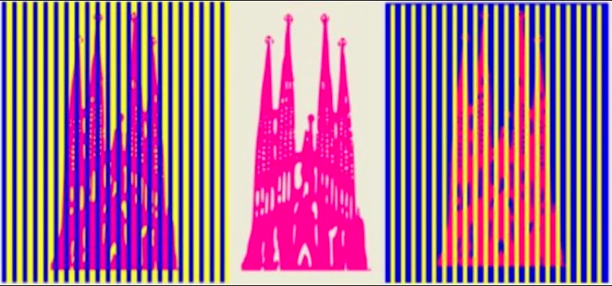
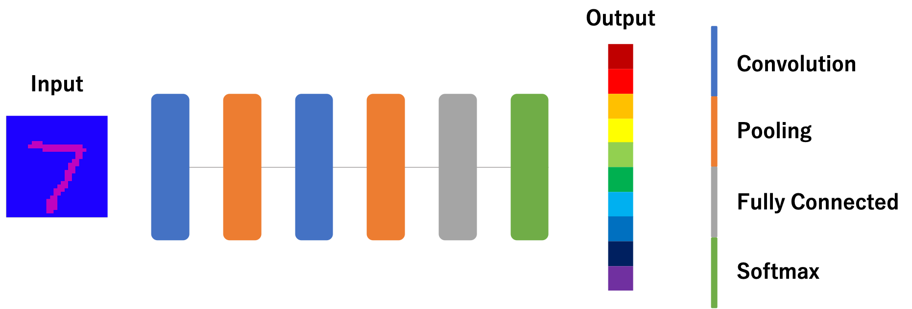

# Optical Illusion Machine Learning
I'm interested this.
**"Whether deep neural networks will be tricked or not"**

This repository is a wacky challenge.

## Optical Illusion

In middle picture, Sagrada Familia color is pink.
But when you look at left picture, you'll get magenta, right picture is orange.
This is "Optical Illusion".

## Dataset

Train dataset is COLORED MNIST which is made from MNIST.  
Label is color of the digit.
Test dataset is ILLUSION MNIST which is made from COLORED MNIST.
Add vertical line to COLORED MNIST.

## Model

Simple model.
This model predict the color of each data.

## References
- https://neurosciencenews.com/cnn-visual-illusion-17298/
- http://www.nibb.ac.jp/press/2018/03/20-2.html
- https://engineering.mercari.com/blog/entry/2017-09-04-170000/
